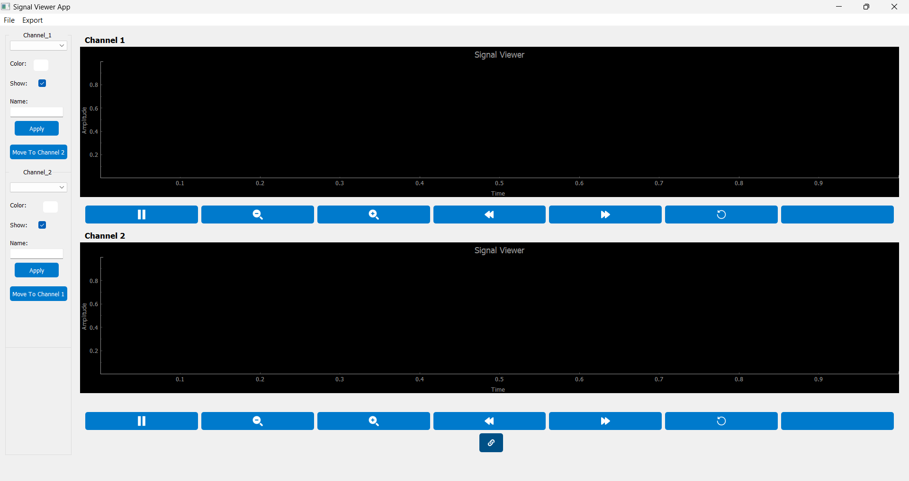
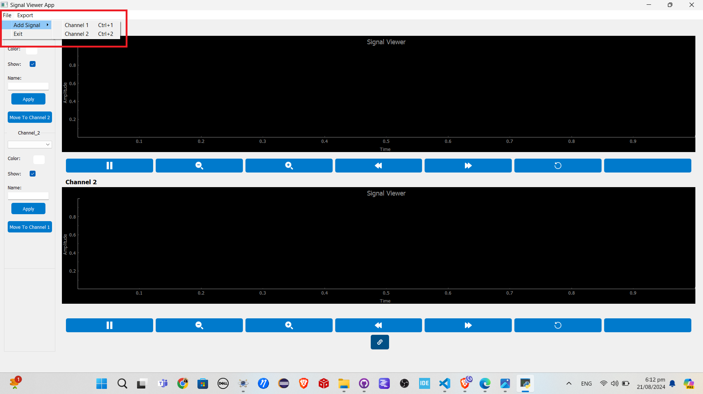
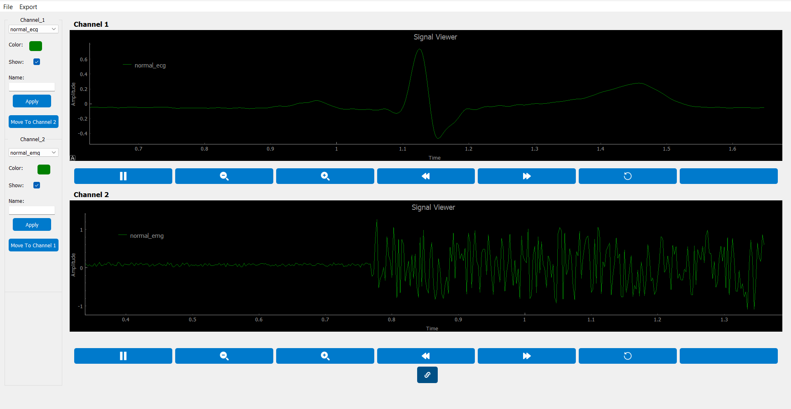
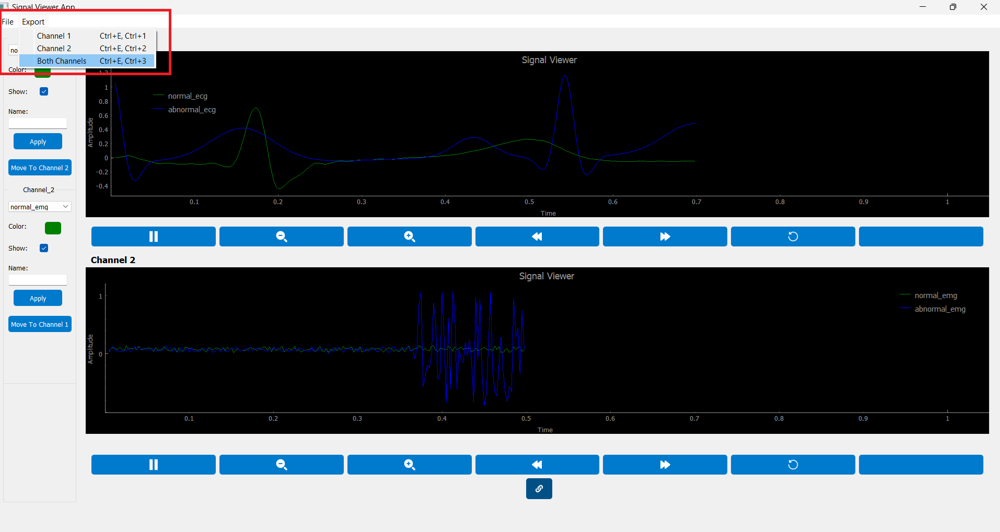
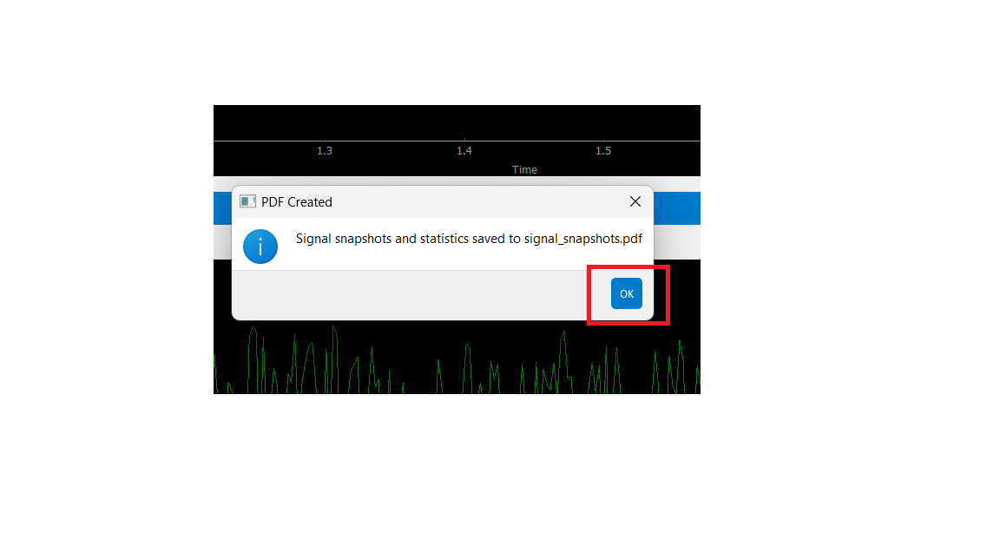
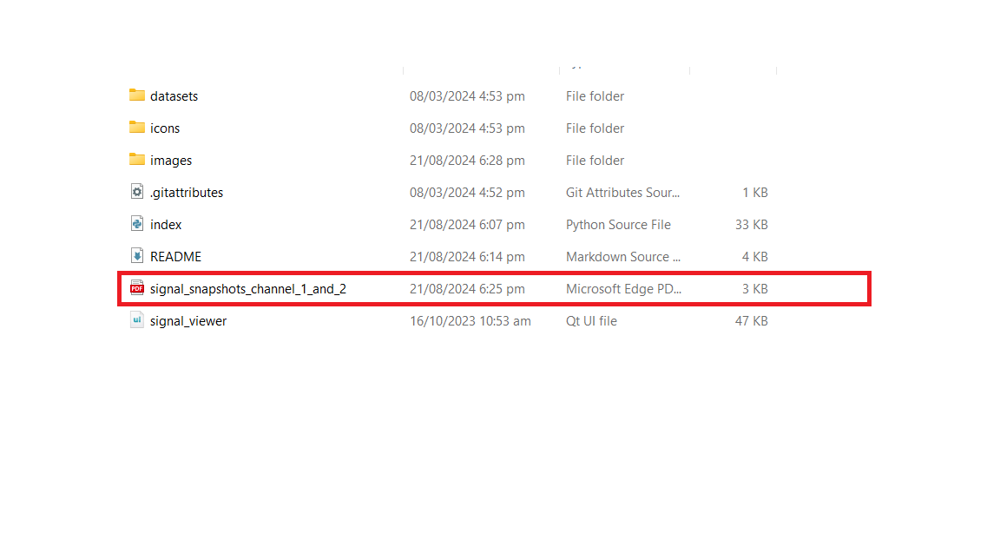
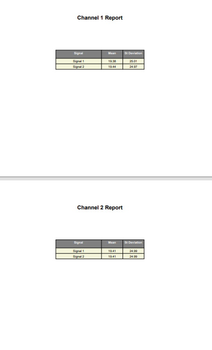
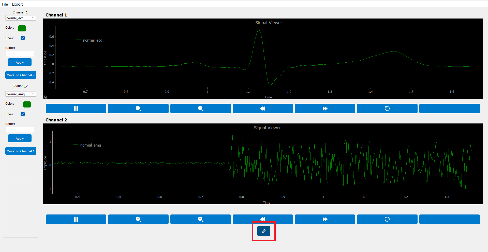

# Multi-Channel Signal Viewer

The Multi-Channel Signal Viewer is a desktop application designed to facilitate the visualization and manipulation of multiple signal channels. This README file will guide you through the key features and functionalities of the application.

## Table of Contents

1. [Introduction](#introduction)
2. [Features](#features)
   - [Uploading Signals](#uploading-signals)
   - [Signal Attributes Adjustment](#signal-attributes-adjustment)
   - [Actions on Signals](#actions-on-signals)
   - [Rewinding Signals](#rewinding-signals)
   - [Exporting Data and Snapshots](#exporting-data-and-snapshots)
   - [Linking Channels](#linking-channels)

## Introduction

The Multi-Channel Signal Viewer is a user-friendly desktop application that allows users to upload, visualize, and manipulate multiple signal channels. With dynamic phase signal loading, users can adjust signal attributes, control individual signals, rewind, export data statistics, and link two channels for synchronized actions.

## Features

### Uploading Signals

1. **Upload Multiple Signals Per Channel:** 

You can upload more than one signal per channel. To do this, navigate to the menu bar, choose "File," then select "Add Signal." Choose the channel you want to plot in. (Note: All signals are uploaded in dynamic phase.)

### Signal Attributes Adjustment

2. **Adjust Signal Attributes:** 

The application provides a Channel Edit window on the left side of the main window. Users can adjust the following attributes:
   - **Change Color:** Customize the color of a signal.
   - **Edit Signal's Name:** Rename signals for easy identification.
   - **Hide Signal:** Toggle visibility using a checkbox.
   - **Move Signal:** Transfer a signal from one channel to another.
   
   To make these changes, select your signal name from the dropdown menu, adjust your settings, and press "Confirm Edits."

### Actions on Signals

3. **Control All Signals in a Channel:** 

Each signal in a channel can be controlled individually with the following actions:
   - **Zoom In/Out:** Zoom in or out to focus on specific sections of the signal.
   - **Speed Up/Speed Down:** Adjust the speed at which the signal is displayed.
   - **Pause/Play:** Control the playback of individual signals.

### Rewinding Signals

4. **Rewind Signals:**

 To reset the signals to their initial state, press the "Rewind" button.

### Exporting Data and Snapshots

5. **Export Data Statistics and Snapshots:** 

You can export data statistics of the plotted graphs along with snapshots of the channels. Exporting can be done for Channel 1, Channel 2, or both channels. To export data, follow these steps:
   - From the menu bar, choose "Export."
   - Select "Channel 1," "Channel 2," or "Both Channels." (Note: If you attempt to export an empty channel, an error message will appear.)

### Linking Channels

6. **Linking Channels:**

Linking the two channels allows actions applied to the first channel to be automatically mirrored in the second channel. This includes actions like zooming in/out, speeding up/down, pausing/playing, and rewinding.

---------------
This Multi-Channel Signal Viewer is a powerful tool for professionals who need to visualize and manipulate multiple signal channels effectively. It offers a range of features to enhance the user experience and provide valuable insights from the data. Enjoy using this application for your signal monitoring and analysis needs!
